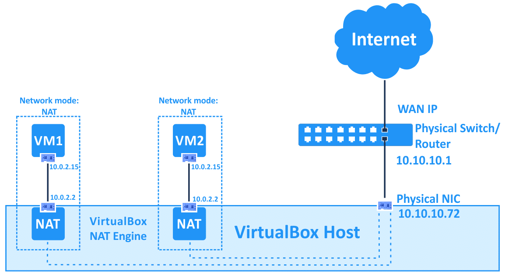

[VirtualBox](https://www.virtualbox.org/) is a great tool often used to simulate an entire lab. It could create all need to accomplish this goal for you.

VirtualBox can create multiples Networks and different virtual machines (VMs). On this post, I will show you how to create a simple lab environment step by step.

On this scenario, I'll use Virtualbox 6 and two type of networks: 

* `Nat Network`, it is the main network which will be use to communicate with the ouside world and other VMs.
* `Host-Only Adapter`, this network is only used to get access on the VM from your desktop.

----

## Steps 

### Installation

You need choose your appropiate package from this [URL](https://www.virtualbox.org/wiki/Linux_Downloads)

For ubuntu users:

```shell
sudo apt-get update
sudo apt-get install virtualbox
```
or

```shell
wget https://download.virtualbox.org/virtualbox/6.0.14/virtualbox-6.0_6.0.14-133895~Ubuntu~xenial_amd64.deb
sudo dpgk -i virtualbox-6.0_6.0.14-133895~Ubuntu~xenial_amd64.deb
```

> Consider install the VirtualBox Extension Pack from [here](https://download.virtualbox.org/virtualbox/6.0.14/Oracle_VM_VirtualBox_Extension_Pack-6.0.14.vbox-extpack)


----

### Network Configuration

#### Host Network 


By default, VirtualBox already creates a `Host-Only Adapter` network, which use this CIDR: `192.168.56.0/24`.

This network will be use only to communicate with your Host (a.k.a your desktop machine). Also, on this lab environment we need a Nat Network, whch is another kind of network

If you don't have this adapter, you need to create it with this simple command

```shell
VBoxManage hostonlyif create
```

----

#### Nat Network



A Nat network is the main network which will be use to communicate your VM with with the outside world. Virtualbox creates this network using these steps.

E.g. Create the network `10.0.2.0/24` with name `natnet`

```shell
VBoxManage natnetwork add --netname natnet --network "10.0.2.0/24" --enable --dhcp on
VBoxManage natnetwork start --netname natnet
```

----
### Virtual Machine Setup

#### Create a VM base

I need to create a VM to use it as base to create other VM's. In this example, I will use Centos 7 image, and the VM will named `centos7`

```shell
export VM=centos7
```

```shell
VBoxManage createvm --name $VM --ostype RedHat_64 --register
```

Now, we need to associate the `natnetwork` created previously with the `nic1` interface

```shell
VBoxManage modifyvm $VM --nic1 natnetwork --nat-network1 natnet
```

Create another nic2 type `Host-Only Adapter`

```shell
VBoxManage modifyvm $VM --nic2 hostonly --hostonlyadapter2 vboxnet0
```

If you want to increase the CPU and Memory, this moment is good to do that 

```shell
VBoxManage modifyvm $VM --cpus 2 --memory 512
```

The VM will need a storage, then create a dynamic disk with 10GB and a SATA Controller to attach it 

```shell
VBoxManage createhd --filename ~/VirtualBox\ VMs/$VM/$VM.vdi --size 10240
VBoxManage storagectl $VM --name "SATA Controller" --add sata --controller IntelAHCI
VBoxManage storageattach $VM --storagectl "SATA Controller" --port 0 --device 0 \
  --type hdd --medium ~/VirtualBox\ VMs/$VM/$VM.vdi
```
Create a IDE controller to mount the iso installer image in order to begin the installation process. E.g. I will use the CentOS 7 minimal image iso. 

> Previously you need to download the iso image

```shell
mkdir ~/isos/
wget \
  http://centos.usetelecom.com.br/centos/7.7.1908/isos/x86_64/CentOS-7-x86_64-Minimal-1908.iso 
  -O ~/isos/
```

```shell
VBoxManage storagectl $VM --name "IDE Controller" --add ide
VBoxManage storageattach $VM --storagectl "IDE Controller" --port 0 \
  --device 0 --type dvddrive --medium ~/isos/CentOS-7-x86_64-Minimal-1908.iso
```

You could setup others miscellaneous system options

```shell
VBoxManage modifyvm $VM --ioapic on
VBoxManage modifyvm $VM --boot1 dvd --boot2 disk --boot3 none --boot4 none
```

And finally, you have a VM created like this:


To start the VM and begin the installation process, use the follow command:

```shell
VBoxManage startvm $VM
```

----

#### Install Centos OS

Start the installation process


Setup your localtime. In my case, as I live in Brazil, it is `America/Sao_Paulo`


Create a `ansible` user, and make it Administrator


Also, you need to setup the root password


Finished the installation, login into the VM as root user and edit the first one NIC


You need to pay attention on this variables:

```toml
BOOTPROTO=static
ONBOOT=yes
IPADDR=10.0.2.2
PREFIX=24
GATEWAY=10.0.2.1
DNS1=10.0.2.1
```


Edit the second NIC


Pay attention on this variables

```toml
BOOTPROTO=static
DEFROUTE=no
ONBOOT=yes
IPADDR=192.168.56.2
PREFIX=24
```


Restart the system network service and check the network connectivity

```shell
systemctl restart network 
ip addr | grep "inet "
ip route
```


#### Testing 

SSH access to VM from the `Host-only Adapter`

```console
$ ssh root@192.168.56.2
root@192.168.56.2's password: 
Last login: Tue Oct 15 23:10:05 2019 from 192.168.56.1
[root@localhost ~]# ping www.terra.com
PING www.terra.com (208.70.188.57) 56(84) bytes of data.
64 bytes from www.terra.com (208.70.188.57): icmp_seq=1 ttl=53 time=151 ms
64 bytes from www.terra.com (208.70.188.57): icmp_seq=2 ttl=53 time=151 ms
^C
--- www.terra.com ping statistics ---
3 packets transmitted, 2 received, 33% packet loss, time 2002ms
[root@localhost ~]# 
```

#### Final Step

Once you have configured the operating system, you can shutdown and eject the DVD.

```console
$ ssh root@192.168.56.2
root@192.168.56.2's password:
Last login: Tue Oct 15 23:10:05 2019 from 192.168.56.1
[root@localhost ~]# halt -p
```

```shell
VBoxManage storageattach $VM --storagectl "IDE Controller" --port 0 \
  --device 0 --type dvddrive --medium none
```


----

### Others usefull commands \#

Start in headless mode
```shell
VBoxManage startvm $VM --type headless
```

Remove nat network 
```shell
VBoxManage natnetwork remove --netname natnet
```

Disable the dhcp
```shell
VBoxManage natnetwork modify --netname natnet --dhcp off
```

Start the nat network
```shell
VBoxManage natnetwork start --netname natnet
```

Take snapshots
```shell
VBoxManage snapshot $VM take <name of snapshot>
```

Revert snapshot
```shell
VBoxManage snapshot $VM restore <name of snapshot>
```

Delete VM
```shell
VBoxManage unregistervm $VM --delete
```

----

### Sources \#

https://www.oracle.com/technical-resources/articles/it-infrastructure/admin-manage-vbox-cli.html

https://www.virtualbox.org/manual/ch08.html

https://www.perkin.org.uk/posts/create-virtualbox-vm-from-the-command-line.html

https://www.nakivo.com/blog/virtualbox-network-setting-guide/

https://www.virtualbox.org/manual/ch06.html

https://www.linuxtechi.com/manage-virtualbox-virtual-machines-command-line/

