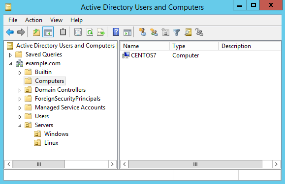
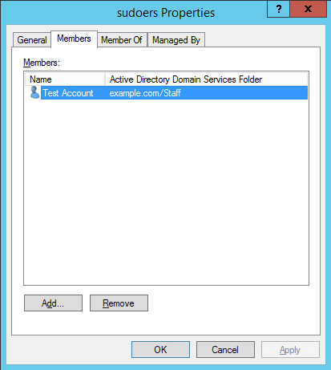

## Intro

These steps were tested using Active Directory on Windows 2008 R2 and Windows 2012 R2.


## Pre-requisites

* Install the packages needed

```console
yum -y install sssd realmd oddjob oddjob-mkhomedir adcli \
  samba-common samba-common-tools krb5-workstation \
  openldap-clients policycoreutils-python
```

* Ensure to use your AD as domain server

```console 
[root@centos7 ~]#  cat /etc/resolv.conf
search example.com
nameserver 192.168.1.2
```


## Joing to Windows Domain

* Using realm command to join into the domain

```console
[root@centos7 ~]# realm join --user=administrator example.com
Password for administrator:
```

* Look into the CentOS machine

```console
[root@centos7 ~]# realm list
example.com
  type: kerberos
  realm-name: EXAMPLE.COM
  domain-name: example.com
  configured: kerberos-member
  server-software: active-directory
  client-software: sssd
  required-package: oddjob
  required-package: oddjob-mkhomedir
  required-package: sssd
  required-package: adcli
  required-package: samba-common-tools
  login-formats: %U@example.com
  login-policy: allow-realm-logins
```

* Look the centOS machine in the Active Directory



* Change the way to get the users in the `sssd.conf` config file. Modify these lines 

```toml
use_fully_qualified_names = True
fallback_homedir = /home/%u@%d
```

```console
[root@centos7 ~]# systemctl restart sssd
```
* Testing this modification

```console
[root@centos7 ~]# id administrator
id: administrator: no such user

[root@centos7 ~]# id administrator@example.com
uid=1829600500(administrator@example.com) gid=1829600513(domain users@example.com) groups=1829600513(domain users@example.com),1829600512(domain
```

* Enable `sudoers` group

```console
[root@centos7 ~]# cat /etc/sudoers.d/sudoers
%sudoers    ALL=(ALL)       ALL
```

* Create a user `test1` and add to group `sudoers`



* Testing

```console
[user1@centos7 ~]$ sudo su
[sudo] password for user1:
[root@centos7 user1]#
[root@centos7 user1]# whoami
root
```
* Leaving the domain

```console
[root@centos7 ~]# realm leave example.com
```

Source: https://www.rootusers.com/how-to-join-centos-linux-to-an-active-directory-domain/
